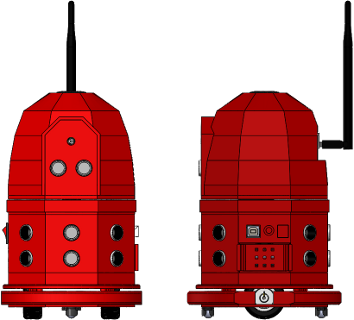

## Project description

Most robot programming environment to teach programming for kids and young people are highly visual, with drag and drop features.
Thus, these interfaces can not be used by blind people or people with a severe visual impairment. 
The goal of this project it to propose a new assitive robot programming environmet that can also be used by blind people to learn programming.
In addition to the visual feedback normaly provided by ordinary robot programming environment, the proposed system also provides sound and vibration feedback to the user.

The same system can also used by blind users to learn and pratice about orientation and mobility skills in a given floorplan in reduced scale.
The user can practice how to move in a certain environment in reduced scale by using a simulated or a real robot. 
This way, when the user goes to the actual environment with the same floorplan, he/she will be able to remember the flooplan and move with more autonomy. 

   
 |   |  |

### Goals

 - Goal 1: deliver a small boat with safe autonomous navigation;
 - Goal 2: deliver a boat control system integrated to planning frameworks;
 - Goal 3: deliver a system to control multiple boats;

### Milestones

 - Milestone 1: integrate more sensors to the Lutra boat to enable autonomous behaviors; status (%)
 - Milestone 2: improve localization for safe autonomous navigation nearby manmade structures (docks) and shores; status (%)
 - Milestone 3: detect obstacles (both underwater and over the water) for safe autonomous navigation nearby manmade structures and shores; status (%)
 - Milestone 4: integrate different navigation strategies (fast, safe, coverage navigation) under real life disturbances (drag, wind, waves) for safe autonomous navigation nearby manmade structures and shores; status (%)
 - Milestone 5: integrate the boat middlware to the AI and planning frameworks; status (%)
 - Milestone 6: control simultaneously multiple boats in formations; status (%)
 - Milestone 7: field test controling simultaneously multiple boats; status (%)

## People

### Coordinator

 - Alexandre Amory and Felipe Menegguzzi, PUCRS.
 - [Isabel Harb Manssour](http://lattes.cnpq.br/4904489502853690)
 - [Marcia Borba Campos](http://lattes.cnpq.br/3266082770151361)

### Academic Collaborators

 - ...

### Students

 - Juliana Damasio, Master student on Computer Science/PUCRS, advised by Marcia Campos, role: usability test, bibliography survey, tests with users.
 - Augusto Cezar Peschke Bergamin, undergraduate student on Computer engineering/PUCRS, advised by Alexandre Amory, role: GoDonnie parser, Player/Stage models.
 - Guilherme Henrique Marculino Marques, undergraduate student on Computer engineering/PUCRS, advised by Alexandre Amory, role: 3D models, electronics, Arduino and Raspberry Pi programming,  Player device drivers.
 - Camila Kolling dos Reis, undergraduate student on Computer engineering/PUCRS, advised by Marcia Campos, role: usability tests.
 - Henry Nunes, undergraduate student on Computer Science/PUCRS, advised by Marcia Campos, role: usability tests.
 - Joice Marek, undergraduate student on Computer Science/PUCRS, advised by Isabel Manssour, role: computer vision, visual odometry.
 - Daniel Centeno Einloft, undergraduate student on Computer Science/PUCRS, advised by Isabel Manssour, role: computer vision, blob finder, Player driver.

## Funding

 - **2017**: [Chamada CNPq/MCTIC/SECIS Nº 20/2016 - TECNOLOGIA ASSISTIVA](resultado.cnpq.br/2914092840905117), BPA/PECDES
 - **2016**: Edital Interno FACIN, BPA/PECDES
 - **2015**: Edital Interno FACIN, BPA/PECDES
 - **2014**: Edital Interno FACIN, BPA/PECDES

## Papers and Reports

 - title and link. full bibio data is already available at ...

## Repositories

 - [Donnie's software enviroment](https://github.com/lsa-pucrs/donnie-assistive-robot-sw)
 - [Donnie's hardware design](https://github.com/lsa-pucrs/donnie-assistive-robot-hw)
 - [Donnie's 3D models for printing](https://github.com/lsa-pucrs/donnie-assistive-robot-3d)

## Main Resources

### Hardware
 
 - Raspberry Pi 2
 - Arduino Mega
 - Speakers
 - Vibration motors
 - Tacticle marks (3D printed)

### Software

 - Player middleware
 - Stage simulator
 - OpenCV
 - Arduino programming
 - Text to Speech

## Media 

videos and photos.

